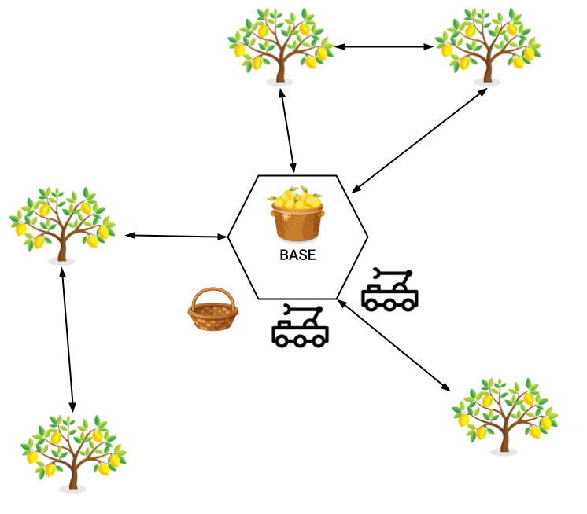

# P2 - Limoneros

En esta práctica profundizaremos en el aprendizaje de PDDL, utilizando features como `:fluents` y `:durative-actions`.

De vuelta en la tierra, contamos con una plantación de limoneros, los cuales son recolectados por robots. La plantación tiene varios árboles, y cada árbol una cantidad de limones. Además, en la plantación hay una base donde se encuentran los utensilios y donde se deben almacenar la fruta recogida.

Por otro lado, cada robot cuenta con un brazo terminado en una pinza, la cual sirve tanto para recolectar limones del árbol como para mover una cesta en la que irán depositando los limones recogidos. Este brazo tiene un inconveniente, y es que no puede levantar más de 50Kg. Esto implica que hay que tener en cuenta el peso de los limones y fijar una carga máxima para la cesta. Cuando la cesta se llene, deberá ser transportada a la base para vaciar su contenido y poder seguir recogiendo limones.

### Navegación en la plantación
En los ejercicios que hemos hecho hasta ahora, siempre ha sido posible moverse desde una ubicación a otra con una sola acción. Esto no es realista, por lo que en este modelo únicamente se podrá realizar la acción de moverse si dos ubicaciones están conectadas. La distribución de las distintas ubicaciones de la plantación se muestra en la siguiente figura:

## Ejercicio 1
Implementa desde cero el modelo para el sistema de recolección automática de limones propuesto, usando `:fluents` y aciones normales (instantáneas). Crea un fichero llamado [lemon_fluent_domain.pddl](pddl/lemon_fluent_domain.pddl) para la definición del dominio y otro llamado [lemon_problem.pddl](pddl/lemon_problem.pddl) para la definición del problema.

### Dominio
El dominio debe incluir un set de `functions` ([numeric fluents](https://planning.wiki/ref/pddl21/domain#numeric-fluents)) para definir las siguientes variables:

* Capacidad máxima de la cesta.
* Carga actual de la cesta.
* El peso de un limón.
* El número (o el peso) de limones en un árbol.

Además, el robot es capaz de realizar las siguientes acciones:

* **move**: El robot se mueve de una ubicación a otra. Sólo es posible si las dos ubicacaiones están conectadas.
* **pick**: Acción de recoger. El robot recoge un objeto con la pinza. El objeto pasa a estar siendo agarrado por la pinza. Tanto la cesta como los limones se pueden considerar "objetos" para esta acción.
* **drop**: Acción de soltar. El robot suelta el objeto de la pinza en una ubicación.
* **deposit**: Acción para depositar un limón en una cesta. El limón debe estar siendo agarrado por la pinza, y tanto el robot como la cesta deben estar en la misma ubicación.
* **unload**: Acción de descargar. El robot descarga el contenido de la cesta en la base. Tanto el robot como la cesta deben estar en la base.

Describe aquí la lista de predicados y funciones necesarios para este modelo, explicando brevemente el propósito de cada uno.
Si lo consideras necesario, puedes modificar las funciones y acciones propuestas.

*[Respuesta]*

### Problema
El archivo de definición del problema debe incluir uno o dos robots, 
las ubicaciones indicadas en el diagrama de la plantación (base y árboles), 
los limones que hay en cada árbol, y al menos una cesta.
También debes inicializar el peso de cada objeto y la capacidad de la cesta con los valores que consideres apropiados.

Finalmente, el objetivo final se debe fijar a que todos los limones acaben descargados en la base.

**Nota**: Como la capacidad de la cesta es de 50Kg, si utilizamos pesos realistas para los limones entrarán muchos y los robots necesitarán muchas acciones para llenarla.
Esto también implica que tendríamos que definir muchos objetos en el problema, lo cual es tedioso.

Por este motivo, podemos "simplificar" el problema definiendo limones muy pesados: Los limones pesan 10Kg.
Hay que definir cuántos limones hay en cada árbol.

### Planificación
Ejecuta el planificador (POPF / OPTIC) con los archivos de dominio y problema implementados y analiza la salida.

¿Intentan los robots llenar la cesta antes de llevarla a la base? ¿La salida del planificador se parece a la que habríamos hecho nosotros?

*[Respuesta]*

Ahora, modifica la capacidad máxima de carga la cesta, o el peso de los limones, o el número de limones en los árboles, y vuelve a ejecutar el planificador. ¿Cambia el plan según lo esperado? 
¿Qué pasa si añadimos o quitamos una cesta?

*[Respuesta]*

## Ejercicio 2
Para tener un modelo más realista, en este segundo ejercicio se deben cambiar las acciones normales por [durative actions](https://planning.wiki/ref/pddl21/domain#durative-actions).
Para esto, crea un nuevo archivo de dominio llamado [lemon_durative_domain.pddl](lemon_durative_domain.pddl). Puedes reutilizar el archivo anterior del problema, pero también puedes crear uno nuevo si lo consideras necesario.

Dispones de libertad para elegir la duración de cada una de las acciones, pero la acción `move` debe ser durar significativamente más que el resto.

Ejecuta el planificador con las nuevas acciones durativas y analiza la salida.

¿Intentan los robots llenar la cesta antes de llevarla a la base?

*[Respuesta]*

¿Cuáles son las diferencias en la salida del planificador con y sin `durative actions`?

*[Respuesta]*

¿Qué diferencia hay entre la salida del planificador POPF y OPTIC? ¿Cuál parece funcionar mejor?

*[Respuesta]*

## Ejercicio extra [*Opcional*]
Incluye una función para expresar la distancia entre dos ubicaciones, y modifica la duración de la acción `move` para que dependa de esta distancia.
Como es necesario modificar tanto el dominio como el problema, puedes crear dos nuevos ficheros [lemon_domain_extra.pddl](pddl/lemon_domain_extra.pddl) y [lemon_problem_extra.pddl](pddl/lemon_problem_extra.pddl) para este ejercicio extra.
