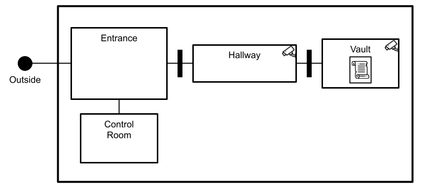

## Enunciado examen

Se debe diseñar un sistema de planificación de tareas basado en PDDL para un sistema de robots ladrones.
Los robots deben ser capaces de infiltrarse en un edificio, desactivar los sistemas de seguridad, y extraer los artefactos valiosos que se encuentren en la caja fuerte.

Este sistema está compuesto por dos tipos de robots: Robots de seguridad (hackers) y de carga (lifters) capaces de realizar tareas específicas.

Ubicaciones:
Los robots pueden moverse de una ubicación a otra siempre y cuando estén conectadas y que la ubicación de destino no tenga activado ningún sistema de seguridad.
En algunos sitios hay puertas para pasar de una ubicación a otra. Para abrir la puerta se necesitan dos robots a la vez.
Una vez abierta la puerta, se considera que las dos ubicaciones están conectadas y que es posible moverse entre ellas.

Hay tres tipos de ubicaciones:
* waypoint: Ubicación genérica.
* vault: Cámara de seguridad. Contiene una caja fuerte.
* control_room: Centro de control de seguridad. Desde aquí se pueden desactivar las cámaras.

En el sistema propuesto, se plantean las siguientes acciones:

* Moverse (`move`): Un robot se mueve de una ubicación a otra.
Para poder desplazarse, la ubicación de destino no debe tener ningún sistema de seguridad (cámaras) activo (`(has_clearance ...)`).

* Desactivar cámara (`disable_camera`): Un robot hacker desactiva una de las cámaras, haciendo que la ubicación en la que está la cámara quede despejada (`(has_clearance ...)`).
El robot debe estar durante todo momento en la sala de control.
**Sólo se puede desactivar una cámara a la vez.**

* Abrir puerta (`open_door`): Dos robots abren una puerta, haciendo que las ubicaciones comunicadas por la puerta pasen a estar conectadas.
Como ayuda, se proporciona una implementación de esta acción.

* Abrir caja fuerte (`open_safe`): Abrir la caja fuerte de la cámara de seguridad. Esta acción sólo la puede realizar un robot hacker.

* Cargar artefacto (`take_artifact`): Llevarse un artefacto de la caja fuerte. Esta acción sólo la puede realizar un robot lifter y la caja debe estar abierta.


A continuación se proporciona una implementación de la acción `open_door`:

```
; Open door together
; Robots must be different and must be both present at ?from location
(:durative-action open_door
:parameters (?r1 ?r2 - robot ?from ?to - location)
:duration (= ?duration 2)
:condition
    (and
        ; There is a door between from and to
        (over all (has_door ?from ?to))
        ; Both robots must be at from
        (over all (robot_at ?r1 ?from))
        (over all (robot_at ?r2 ?from))
        ; Robots r1 and r2 cannot be the same robot
        (over all (not (= ?r1 ?r2)))
    )
:effect
    (and
        ; Now it is possible to move through the door
        (at end (connected ?from ?to))
        (at end (connected ?to ?from))
    )
)
```

Se dispone de un problema PDDL de referencia en el archivo adjunto [robot_heist_problem.pddl](robot_heist_problem.pddl) y del plan generado para este problema por el planificador POPF (con las opciones por defecto) en [popf_output.txt](popf_output.txt).
En el problema propuesto tiene las ubicaciones que se muestran en la siguiente figura:



Implementa el dominio PDDL para el sistema de planificación propuesto, de tal forma que al ejecutar POPF con el dominio implementado y el problema de referencia se genere la siguiente salida:

```
0.000: (move cage_bot outside entrance)  [5.000]
0.000: (move hacker_bot outside entrance)  [5.000]
5.001: (open_door hacker_bot cage_bot entrance hallway)  [2.000]
7.001: (move hacker_bot entrance control)  [5.000]
12.001: (disable_camera hacker_bot control cam_hallway hallway)  [3.000]
15.001: (move cage_bot entrance hallway)  [5.000]
15.002: (disable_camera hacker_bot control cam_vault secret_vault)  [3.000]
18.002: (move hacker_bot control entrance)  [5.000]
23.003: (move hacker_bot entrance hallway)  [5.000]
28.003: (open_door hacker_bot cage_bot hallway secret_vault)  [2.000]
30.003: (move hacker_bot hallway secret_vault)  [5.000]
30.003: (move cage_bot hallway secret_vault)  [5.000]
35.003: (open_safe hacker_bot secret_vault)  [15.000]
50.003: (move hacker_bot secret_vault hallway)  [5.000]
50.003: (take_artifact cage_bot declaration_of_independence secret_vault)  [1.000]
51.003: (move cage_bot secret_vault hallway)  [5.000]
55.004: (move hacker_bot hallway entrance)  [5.000]
56.004: (move cage_bot hallway entrance)  [5.000]
60.005: (move hacker_bot entrance outside)  [5.000]
61.005: (move cage_bot entrance outside)  [5.000]
```

Nota: Es posible que la salida generada por POPF no sea exactamente igual que la proporcionada, pero las restricciones planteadas y las duraciones de las acciones se deben respetar.

Entrega:
Deberás subir un fichero (domain.pddl) con el dominio pddl para este sistema de planificación.
